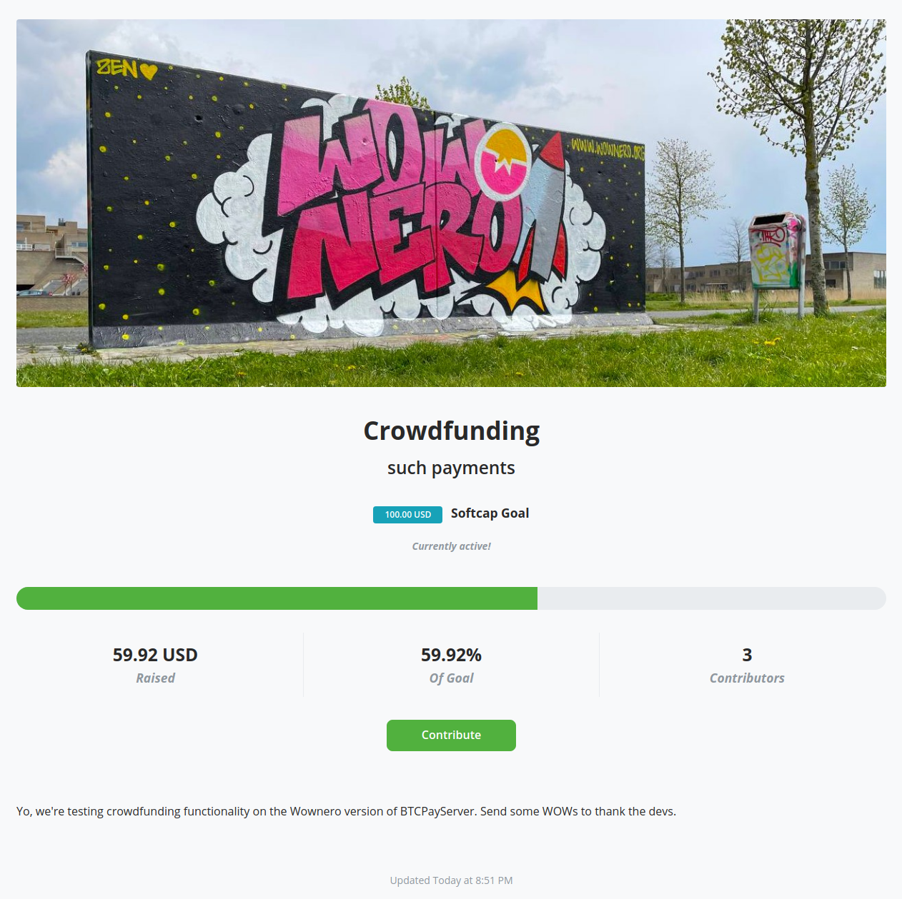

# BTCPayServer Wownero

This repo sets up a new [BTCPayServer](https://btcpayserver.org/) for Wownero!




## Launch A Web Store

1. Launch a new Ubuntu VPS
2. Purchase a domain and setup a DNS A record for the VPS (i.e. your hosting URL)
2. SSH into the VPS as `root`
3. Run the init script:

```bash
# replace the values below with yours
export BTCPAY_HOST=mywownerowebshop.com
export EMAIL=admin@mywownerowebshop.com
curl https://raw.githubusercontent.com/lalanza808/btcpayserver-wownero/refs/heads/master/cloud-init.sh | bash
```

That should set everything up. Hit me up in the [issues](https://github.com/lalanza808/btcpayserver-wownero/issues) or on [x.com](https://x.com/lza_menace) if there's a problem.

It will setup a firewall with the ports you need open, Docker engine, Tor relay and Onion site, and Nginx web server. The installation will be in `/opt/btcpay`.

Afterwards, go to your URL to setup your admin user to start configuring the shop.

### Wallet

**You will need to upload a view only wallet.**

Use [Wowlet](https://wowlet.app) to create a new wallet. Use the GUI to "Create view-only wallet" and save it with a strong password.

In the BTCPayServer wallet settings you will have an upload form to upload your wallet file, keys file, and password.


Read this guide for more information on setting it up: https://sethforprivacy.com/guides/accepting-monero-via-btcpay-server/#create-a-view-only-monero-wallet-via-feather-wallet

Read the documentation to learn how to use BTCPayServer: https://docs.btcpayserver.org/WhatsNext/


## Test It Out

1. Clone it
2. Run it
```bash
git clone https://github.com/lalanza808/btcpayserver-wownero --recursive
cd btcpayserver-wownero
docker-compose build
docker-compose up -d
```
3. Open browser to http://127.0.0.1:49392


